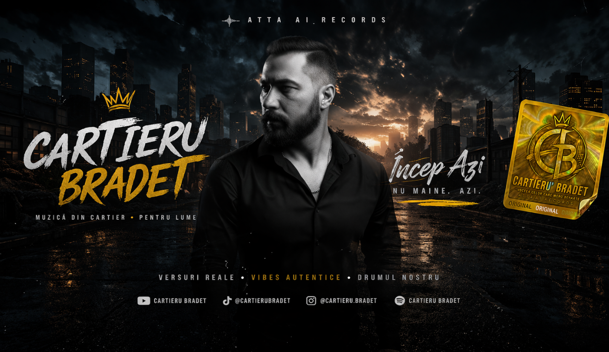

# ATTA AI Records Website

Production-ready foundation for the official **Cartieru' Bradet / ATTA AI Records** website.

## Branding

### Logo


### Key visuals




## Released Music

- Official music page: `/music`
- Featured release page example: `/music/[slug]`
- DistroKid Instant Share: https://distrokid.com/instantshare/0dWGu4

## Stack

- Next.js (App Router, TypeScript)
- Tailwind CSS
- Supabase (PostgreSQL, Auth, Storage)
- Vercel deployment target

## Included

- Public pages: home, music listing, album detail, about, contact
- Public merch pages: `/merch`, `/merch/[slug]`
- Auth page: `/login`
- Protected admin area: `/admin/dashboard`, `/admin/albums`, `/admin/tracks`, `/admin/media`, `/admin/settings`, `/admin/merch`
- Role-aware authorization (`admin`, `editor`, `media_manager`)
- Supabase server/browser/middleware clients
- SQL migrations for core schema, audit logs, and merch catalog

## Local setup

1. Install dependencies:
   ```bash
   npm install
   ```
2. Configure env vars:
   ```bash
   cp .env.example .env.local
   ```
3. Fill `.env.local` with your Supabase project values.
4. Run the app:
   ```bash
   npm run verify:setup
   npm run dev
   ```

## Development readiness checks

Before every release candidate run:

```bash
npm run verify:setup
npm run check
npm run build
```

Health endpoint for quick checks:

```bash
GET /api/health
```

Expected JSON:
- `status: ok`
- `services.supabasePublicConfig: configured | missing`

## Database setup (Supabase SQL editor)

Run:

- `supabase/migrations/202604040001_initial_schema.sql`
- `supabase/migrations/202604040002_audit_logs.sql`
- `supabase/migrations/202604040003_merch_products.sql`
- `supabase/migrations/202604040004_user_role_bootstrap.sql`
- `supabase/migrations/202604050005_track_likes.sql`

`202604040004_user_role_bootstrap.sql` auto-creates/updates `public.users` rows from `auth.users` and assigns `admin` to `cartierubradet@gmail.com`.

## Notes

- Public pages use fallback content when Supabase is not configured.
- Media uploads target Supabase Storage bucket `media-assets`.
- Admin actions are implemented as Next.js Server Actions.
- Admin includes an audit log page at `/admin/audit`.
- Cloudflare free plan: keep `minify: true` in `wrangler.jsonc` and protect routes against bot traffic to reduce request burn.
